# Generex Orchestration System

## Overview

The Generex Orchestration System is a sophisticated multi-agent architecture designed to handle complex customer interactions for service-based businesses. The system orchestrates multiple specialized agents that work together to provide intelligent, context-aware responses and manage various business workflows.

## Architecture Overview

The system follows a state-driven workflow pattern where each agent processes specific aspects of user interactions and maintains conversation context across sessions. The workflow is managed through a central `Chain` class that coordinates all agent activities.

## Workflow Diagram

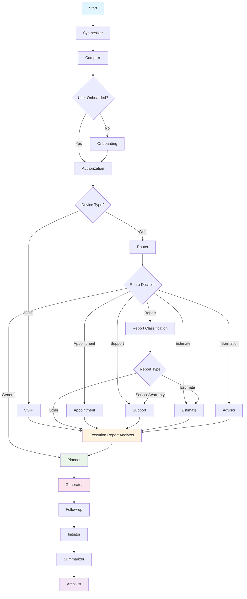

## Core Components

### 1. Chain Class (`chain.py`)
The central orchestrator that manages all agent interactions and state transitions.

**Key Responsibilities:**
- Session management and context initialization
- State management across all agents
- Error handling and timeout management
- Coordination between different workflow nodes

### 2. Workflow Manager (`workflow.py`)
Defines the execution flow and routing logic between different agents.

**Key Features:**
- Conditional routing based on user state and intent
- Device-specific routing (VOIP vs web)
- Authorization and onboarding flow management

## Agent Nodes Documentation

### 🔄 **Start Node**

**Purpose**: Initializes the conversation session

**Dependencies**: Session data, device information

**Step-wise Functionality:**
1. Initialize conversation session
2. Load session data and device information
3. Set initial state with device and input data
4. Prepare context for downstream agents

**Business Value:**
1. **Session Initialization**: Establish user session for personalized experience
2. **Context Loading**: Load user history and preferences for continuity
3. **Device Detection**: Identify platform for optimized interaction
4. **State Preparation**: Set foundation for seamless conversation flow

**Output**: Initial state with device and input data

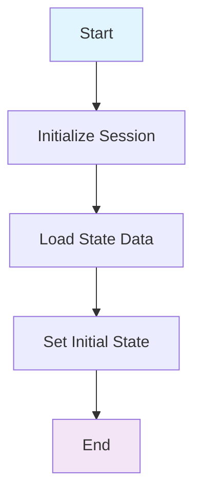

### 🔍 **Synthesizer Node**

**Purpose**: Processes and contextualizes user input

**Dependencies**: Conversation history, user context, company data

**Key Functions**:
- Extracts context from user input
- Determines content type and origin
- Prepares contextual information for downstream agents

**Step-wise Functionality:**
1. Extract context from user input
2. Determine content type and origin
3. Process conversation history and user context
4. Prepare contextual information for downstream agents
5. Enhance input data with company context

**Business Value:**
1. **Context Extraction**: Understand user's current situation and needs
2. **Input Enhancement**: Enrich user messages with business context
3. **Content Classification**: Categorize requests for proper routing
4. **Context Preparation**: Provide rich context for intelligent decision-making

**Output**: Enhanced input data with context

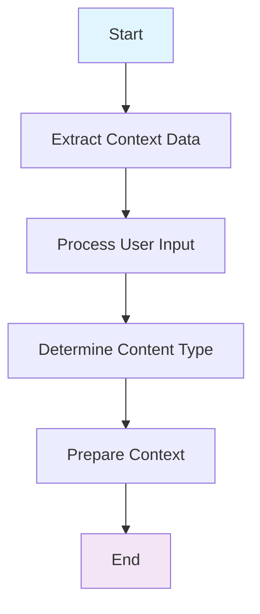

### 🧠 **Comprex Node**

**Purpose**: Intent Understanding Agent that processes and enriches user messages

**Dependencies**: Conversation history, conversation summary, last message

**Specific Work**:
- **Analyzes conversation context** to understand full interaction history
- **Enhances partial or unclear messages** while maintaining core meaning
- **Confirms understanding** of ambiguous requests through enrichment
- **Processes follow-up questions** by considering immediate context
- **Handles direct responses** to system questions (e.g., "Yes" → "User confirmed...")
- **Maintains conversation continuity** by analyzing conversation summary and history

**Key Capabilities**:
- Message enhancement for incomplete user inputs
- Context-aware intent clarification
- Follow-up question processing
- Response validation and enrichment

**Step-wise Functionality:**
1. Analyze conversation context to understand full interaction history
2. Enhance partial or unclear messages while maintaining core meaning
3. Confirm understanding of ambiguous requests through enrichment
4. Process follow-up questions by considering immediate context
5. Handle direct responses to system questions (e.g., "Yes" → "User confirmed...")
6. Maintain conversation continuity by analyzing conversation summary and history
7. Output structured user intent with enriched context

**Business Value:**
1. **Intent Understanding**: Decode user's true business needs and goals
2. **Message Enhancement**: Clarify ambiguous requests to prevent misrouting
3. **Context Continuity**: Maintain conversation flow across interactions
4. **Response Processing**: Handle user confirmations and clarifications
5. **Business Alignment**: Ensure user intent aligns with service capabilities

**Output**: Structured user intent with enriched context

### 📋 **Planner Node**

**Purpose**: Strategic conversation planner creating high-quality plans for natural conversation flow

**Dependencies**: User intent, execution reports, conversation history, company context

**Specific Work**:
- **Creates strategic conversation plans** based on user intent and execution results
- **Prioritizes execution results** over user intent when system actions are pending
- **Guides business outcomes** through natural dialogue progression
- **Maintains safety guidelines** by avoiding unconfirmed promises
- **Uses different planning strategies**:
  - **General Planner**: For general conversations and information requests
  - **Action Planner**: For action-based workflows (appointments, support, estimates)
- **Implements tone guidelines** based on execution status

**Key Capabilities**:
- Execution priority management
- Business outcome alignment
- Natural flow planning
- Safety-first approach

**Step-wise Functionality:**
1. Create strategic conversation plans based on user intent and execution results
2. Prioritize execution results over user intent when system actions are pending
3. Guide business outcomes through natural dialogue progression
4. Maintain safety guidelines by avoiding unconfirmed promises
5. Use different planning strategies:
   - General Planner: For general conversations and information requests
   - Action Planner: For action-based workflows (appointments, support, estimates)
6. Implement tone guidelines based on execution status
7. Output strategic conversation plan with tone and approach guidance

**Business Value:**
1. **Strategic Planning**: Create conversation strategies that drive business outcomes
2. **Priority Management**: Focus on high-value actions and user needs
3. **Business Goal Alignment**: Guide conversations toward revenue-generating activities
4. **Safety Compliance**: Prevent over-promising and ensure legal compliance
5. **Tone Optimization**: Match conversation style to business context

**Output**: Strategic conversation plan with tone and approach guidance

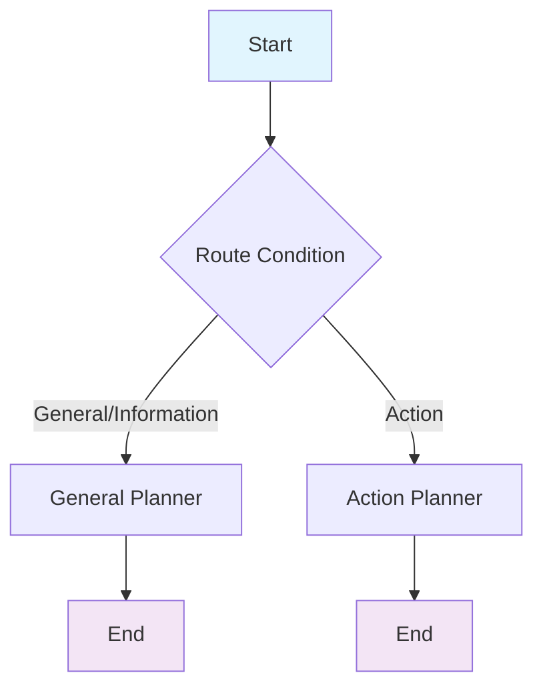

### 🚪 **Onboarding Node**

**Purpose**: Manages new user onboarding process with SOP enforcement

**Dependencies**: User verification status, email/phone verification, SOP checklists

**Specific Work**:
- **Enforces onboarding SOPs** using `sop_enforcer` template and `sop_checklists/onboarding`
- **Collects user information** (name, email, phone, location, customer status)
- **Manages verification processes** for email and phone
- **Uses tool-based verification** with `UserTool` for email and phone verification
- **Saves user details** to database and updates session context
- **Handles multi-step verification** with conditional routing

**Key Capabilities**:
- SOP enforcement and validation
- Tool-based verification
- Database integration
- Multi-step process management

**Step-wise Functionality:**
1. Enforce onboarding SOPs using `sop_enforcer` template and `sop_checklists/onboarding`
2. Collect user information (name, email, phone, location, customer status)
3. Manage verification processes for email and phone
4. Use tool-based verification with `UserTool` for email and phone verification
5. Save user details to database and updates session context
6. Handle multi-step verification with conditional routing
7. Output onboarding status, verification results, and user data

**Business Value:**
1. **User Registration**: Capture essential customer information for business relationship
2. **Identity Verification**: Ensure data quality and prevent fraud
3. **Customer Classification**: Identify customer type for targeted service
4. **Database Integration**: Store customer data for future business interactions
5. **Verification Process**: Build trust through email/phone verification

**Output**: Onboarding status, verification results, and user data

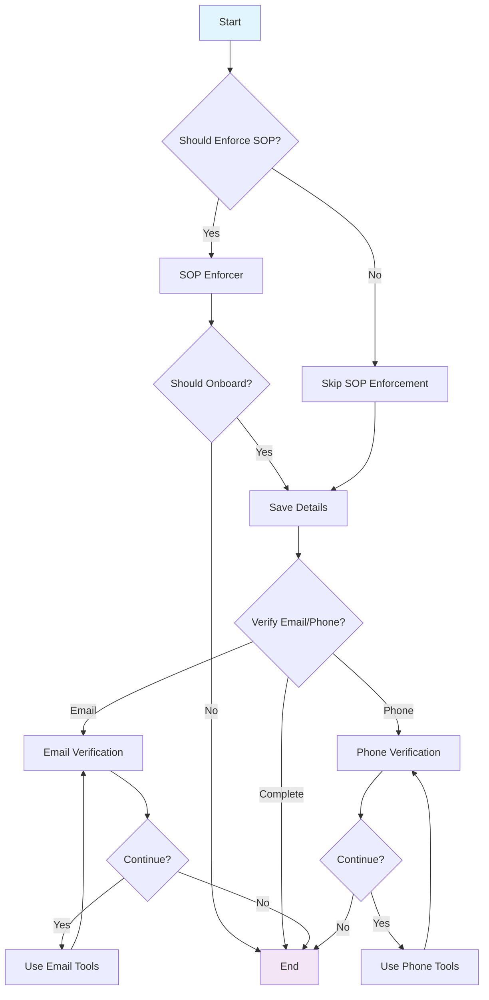

### 🔐 **Authorization Node**

**Purpose**: Handles user authentication and authorization

**Dependencies**: User credentials, session data

**Key Functions**:
- Validates user permissions
- Manages access control
- Handles authentication flows

**Step-wise Functionality:**
1. Validate user credentials
2. Check user permissions and access control
3. Handle authentication flows
4. Set authorization status
5. Output authorization status

**Business Value:**
1. **Access Control**: Ensure only authorized users access services
2. **Security Validation**: Protect business systems and customer data
3. **Permission Management**: Control feature access based on user type
4. **Compliance Enforcement**: Meet regulatory and security requirements

**Output**: Authorization status

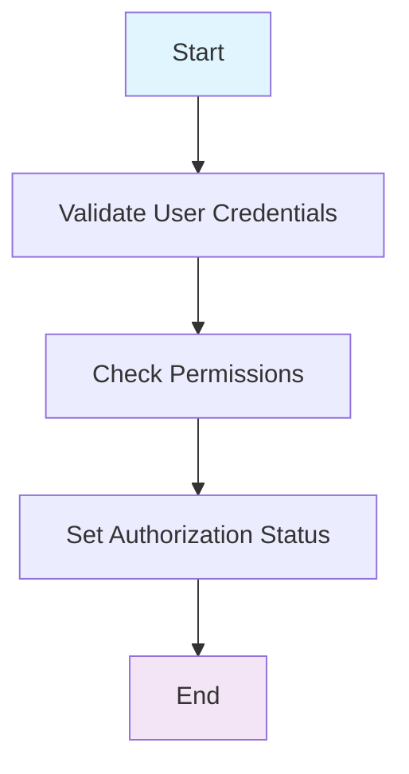

### 📞 **VOIP Node**

**Purpose**: Manages voice-over-IP interactions

**Dependencies**: Calendar availability, company info

**Key Functions**:
- Handles voice call requests
- Manages call scheduling
- Provides voice-specific responses

**Step-wise Functionality:**
1. Load VOIP template
2. Format context data with calendar availability and company info
3. Execute VOIP chain for voice call handling
4. Manage call scheduling
5. Extract voice-specific response
6. Output VOIP response and call management

**Business Value:**
1. **Voice Interaction**: Enable phone-based customer service
2. **Call Management**: Handle voice call scheduling and coordination
3. **Calendar Integration**: Optimize appointment scheduling
4. **Voice Response**: Provide natural voice-based customer support

**Output**: VOIP response and call management

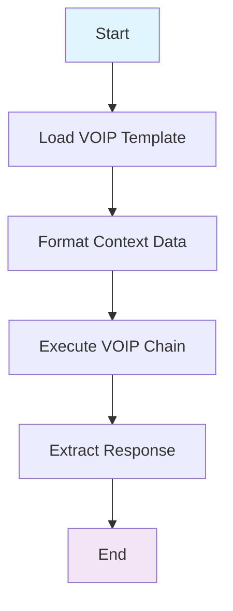

### 🛣️ **Router Node**

**Purpose**: AI-powered routing assistant for selecting optimal conversation routes

**Dependencies**: User intent, conversation context, pending tasks, previous routes

**Specific Work**:
- **Analyzes user intent** to understand primary needs and context
- **Implements weighted decision system**:
  - Explicit User Intent (Weight: 0.8)
  - Pending Tasks (Weight: 0.3)
  - Previous Context (Weight: 0.2)
- **Routes to specialized agents** based on intent classification:
  - **General**: Social pleasantries, casual conversation
  - **Appointment**: Scheduling, time slots, modifications
  - **Support**: Customer service, warranty claims
  - **Information**: Factual questions, educational content
  - **Report**: Classification for estimates, service, warranty
- **Maintains conversation continuity** by considering previous routes

**Key Capabilities**:
- Intent-based routing
- Weighted decision making
- Context preservation
- Route optimization

**Step-wise Functionality:**
1. Analyze user intent to understand primary needs and context
2. Implement weighted decision system:
   - Explicit User Intent (Weight: 0.8)
   - Pending Tasks (Weight: 0.3)
   - Previous Context (Weight: 0.2)
3. Route to specialized agents based on intent classification:
   - General: Social pleasantries, casual conversation
   - Appointment: Scheduling, time slots, modifications
   - Support: Customer service, warranty claims
   - Information: Factual questions, educational content
   - Report: Classification for estimates, service, warranty
4. Maintain conversation continuity by considering previous routes
5. Output selected route with confidence score and reasoning

**Business Value:**
1. **Intelligent Routing**: Direct users to most appropriate service channel
2. **Service Matching**: Connect user needs with business capabilities
3. **Efficiency Optimization**: Minimize conversation friction and time
4. **Business Logic**: Apply weighted decision-making for optimal outcomes
5. **Context Preservation**: Maintain conversation continuity for better UX

**Output**: Selected route with confidence score and reasoning

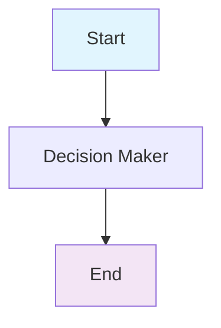

### 📊 **Report Classification Node**

**Purpose**: Classifies user reports and requests

**Dependencies**: User input, conversation context

**Key Functions**:
- Categorizes reports (estimate, service, warranty)
- Determines appropriate workflow
- Routes to specialized handlers

**Step-wise Functionality:**
1. Analyze user input for report classification
2. Classify report type (estimate, service, warranty)
3. Determine appropriate workflow based on classification
4. Route to specialized handlers:
   - Estimate → Estimate Route
   - Service/Warranty → Support Route
   - Other → General Route
5. Output report classification and SOP steps

**Business Value:**
1. **Request Categorization**: Classify user needs for proper service delivery
2. **Workflow Selection**: Route to appropriate business process
3. **Service Matching**: Connect user requests with business capabilities
4. **Process Optimization**: Ensure efficient handling of different request types

**Output**: Report classification and SOP steps

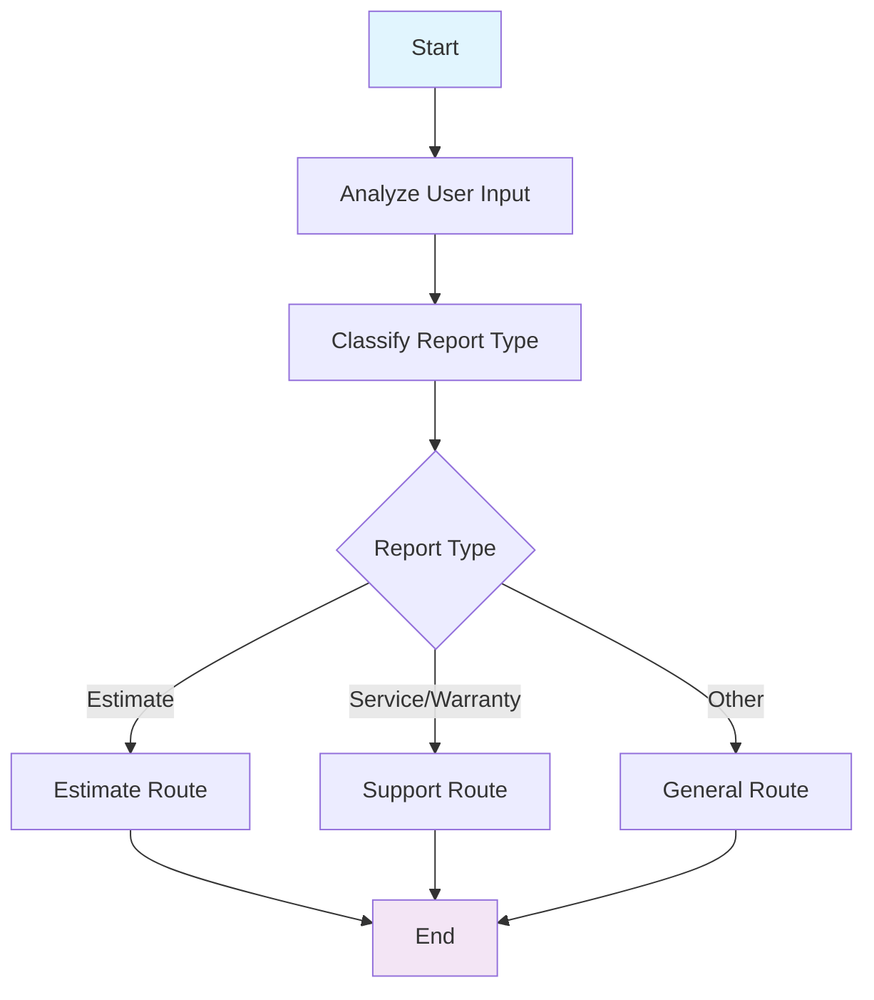

### 🛠️ **Support Node**

**Purpose**: Handles customer support requests with SOP enforcement

**Dependencies**: Support tickets, service history, SOP checklists

**Specific Work**:
- **Enforces support SOPs** using `sop_enforcer` template and `sop_checklists/support`
- **Manages dynamic SOPs** for complex support workflows
- **Creates support tickets** using `SupportTool`
- **Handles warranty claims** and service requests
- **Processes service warranty reports** with dynamic SOP enforcement
- **Uses tool integration** for support operations

**Key Capabilities**:
- SOP enforcement and validation
- Dynamic SOP management
- Ticket creation and management
- Warranty claim processing

**Step-wise Functionality:**
1. Enforce support SOPs using `sop_enforcer` template and `sop_checklists/support`
2. Manage dynamic SOPs for complex support workflows
3. Create support tickets using `SupportTool`
4. Handle warranty claims and service requests
5. Process service warranty reports with dynamic SOP enforcement
6. Use tool integration for support operations
7. Store report data and finalize service warranty reports
8. Output support responses, SOP steps, and ticket information

**Business Value:**
1. **Issue Resolution**: Solve customer problems to maintain satisfaction
2. **Ticket Management**: Track and manage support requests efficiently
3. **Warranty Processing**: Handle warranty claims for customer retention
4. **Service Documentation**: Maintain records for business intelligence
5. **Quality Assurance**: Ensure support meets business standards

**Output**: Support responses, SOP steps, and ticket information

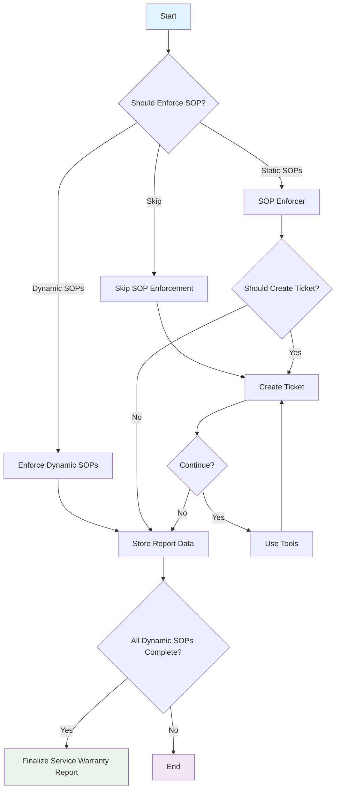

### 📅 **Appointment Node**

**Purpose**: Manages appointment booking and scheduling

**Dependencies**: Calendar data, availability

**Key Functions**:
- Books appointments
- Manages scheduling conflicts
- Handles rescheduling requests

**Step-wise Functionality:**
1. Enforce appointment SOPs
2. Determine if appointment should be created
3. Create appointment if required
4. Use tools for appointment management
5. Handle scheduling conflicts and rescheduling requests
6. Output appointment confirmations and calendar updates

**Business Value:**
1. **Scheduling Management**: Book appointments to drive revenue
2. **Calendar Optimization**: Maximize business capacity utilization
3. **Conflict Resolution**: Handle scheduling conflicts professionally
4. **Confirmation Process**: Ensure appointment reliability and reduce no-shows

**Output**: Appointment confirmations and calendar updates

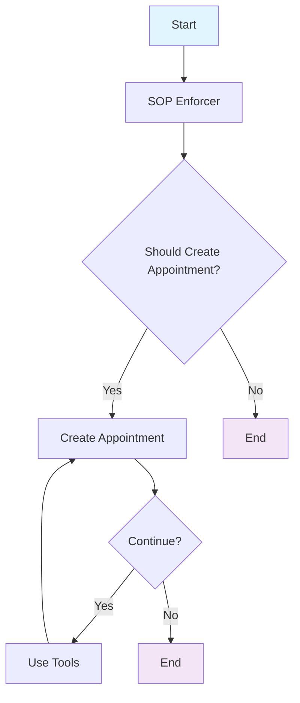

### 💰 **Estimate Node**

**Purpose**: Handles price estimation and quotes with comprehensive workflow

**Dependencies**: Service catalog, pricing data, SOP checklists

**Specific Work**:
- **Manages service selection** and service details
- **Verifies property addresses** for accurate estimates
- **Processes image uploads** for visual assessment
- **Enforces estimation SOPs** using `sop_enforcer` and `sop_checklists/estimate`
- **Handles dynamic SOPs** for complex estimation scenarios
- **Uses `EstimationTool`** for price calculations and service management
- **Finalizes estimate reports** with comprehensive pricing

**Key Capabilities**:
- Service catalog management
- Address verification
- Image processing
- Dynamic SOP enforcement
- Price calculation

**Step-wise Functionality:**
1. Route to appropriate estimation workflow (verify address, get services, etc.)
2. Manage service selection and service details
3. Verify property addresses for accurate estimates
4. Process image uploads for visual assessment
5. Enforce estimation SOPs using `sop_enforcer` and `sop_checklists/estimate`
6. Handle dynamic SOPs for complex estimation scenarios
7. Use `EstimationTool` for price calculations and service management
8. Store report data and finalize estimate reports
9. Output estimates, pricing information, and service details

**Business Value:**
1. **Service Assessment**: Evaluate customer needs for accurate pricing
2. **Address Verification**: Ensure service delivery feasibility
3. **Visual Analysis**: Process images for accurate cost estimation
4. **Price Calculation**: Generate competitive and profitable quotes
5. **Service Documentation**: Create detailed estimates for business records

**Output**: Estimates, pricing information, and service details

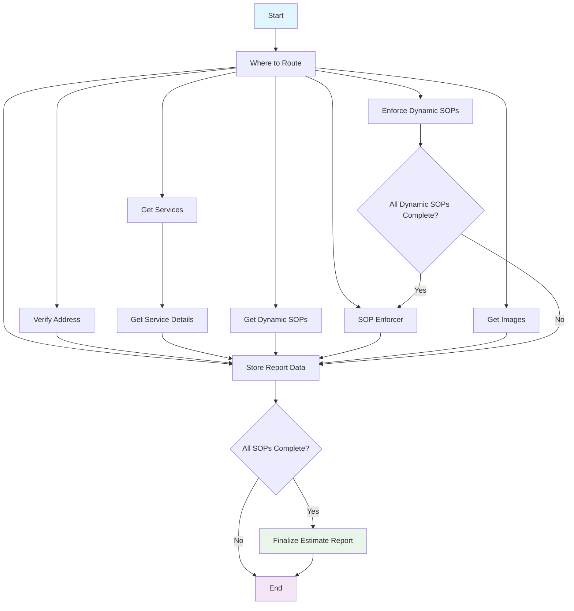

### 🎯 **Advisor Node**

**Purpose**: Provides general information and advice

**Dependencies**: Knowledge base, company information

**Key Functions**:
- Answers general questions
- Provides recommendations
- Shares company information

**Step-wise Functionality:**
1. Retrieve relevant information using retriever
2. Process advisor logic for information provision
3. Present recommendations and company information
4. Answer general questions and provide advice
5. Output informational responses

**Business Value:**
1. **Information Provision**: Share knowledge to build customer trust
2. **Recommendation Engine**: Suggest relevant services for upselling
3. **Educational Support**: Help customers make informed decisions
4. **Brand Building**: Position company as knowledgeable industry expert

**Output**: Informational responses

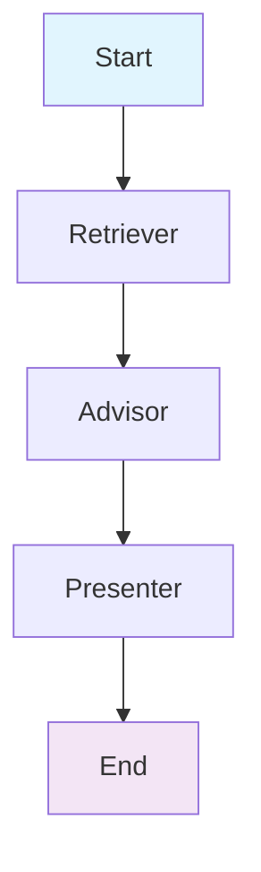

### 📈 **Execution Report Analyzer Node**

**Purpose**: Specialized processor for execution reports in conversational AI system

**Dependencies**: Execution reports, conversation history, agent outputs

**Specific Work**:
- **Analyzes execution reports** to identify pending tasks and outcomes
- **Creates point-wise summaries** of execution results
- **Extracts pending SOPs** in their original order
- **Identifies missing details** and required user actions
- **Processes errors** and provides resolution guidance
- **Tracks execution sequence** and maintains order

**Key Capabilities**:
- Execution report analysis
- Task extraction and prioritization
- Error identification and resolution
- SOP tracking and management

**Step-wise Functionality:**
1. Analyze execution reports to identify pending tasks and outcomes
2. Create point-wise summaries of execution results
3. Extract pending SOPs in their original order
4. Identify missing details and required user actions
5. Process errors and provide resolution guidance
6. Track execution sequence and maintain order
7. Output execution summary and list of pending SOPs

**Business Value:**
1. **Process Monitoring**: Track business process completion
2. **Task Prioritization**: Identify high-priority actions for business value
3. **Quality Control**: Ensure business processes meet standards
4. **Performance Analysis**: Monitor efficiency and identify improvements
5. **Compliance Tracking**: Ensure business processes follow regulations

**Output**: Execution summary and list of pending SOPs

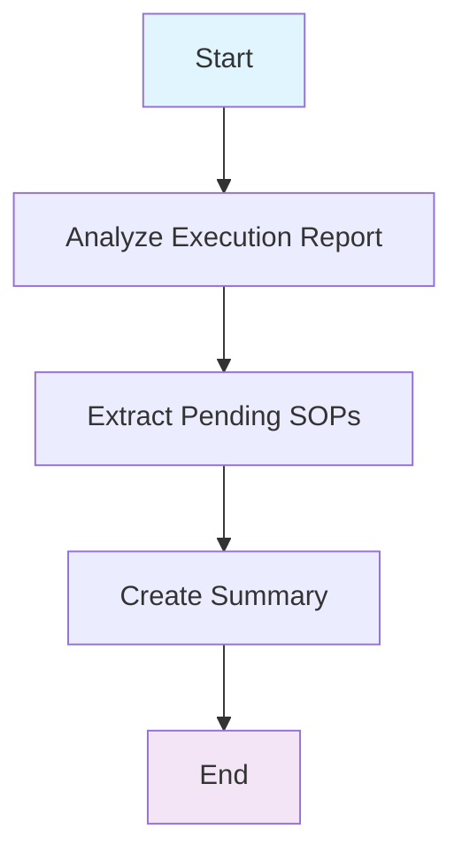

### 🤖 **Generator Node**

**Purpose**: Human-like conversational assistant composing natural, engaging responses

**Dependencies**: All previous agent outputs, conversation plan, user context

**Specific Work**:
- **Follows Generation Plan exactly** using tone, approach, and strategy guidance
- **Composes natural responses** with human-like expression patterns
- **Coordinates main message and followup** to create seamless flow
- **Maintains voice compatibility** for spoken interactions
- **Implements safety guidelines** by avoiding unconfirmed promises
- **Uses conversational techniques**:
  - Natural contractions and interjections
  - Emotional expression and empathy
  - Conversational transitions
  - Personality and authenticity

**Key Capabilities**:
- Natural language generation
- Plan adherence
- Safety compliance
- Voice optimization
- Human-like expression

**Step-wise Functionality:**
1. Read Generation Plan to understand strategic guidance
2. Plan message coordination between main and followup
3. Apply plan strategy using tone, approach, and flow
4. Address user request using plan guidance with human expression
5. Create followup using plan's next steps naturally
6. Validate safety to ensure no unconfirmed promises
7. Check coordination to ensure messages work together seamlessly
8. Review for naturalness to ensure human-like responses
9. Output final user response with optional followup message

**Business Value:**
1. **Response Creation**: Generate engaging, business-appropriate responses
2. **Brand Voice Maintenance**: Ensure consistent company communication
3. **Customer Engagement**: Create responses that drive continued interaction
4. **Safety Compliance**: Prevent legal and reputational risks
5. **Conversation Flow**: Maintain natural dialogue for better customer experience

**Output**: Final user response with optional followup message

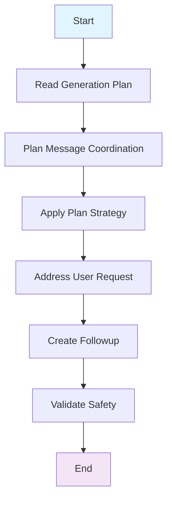

### 💬 **Follow-up Node**

**Purpose**: Manages follow-up messages and clarifications

**Dependencies**: Generator output, conversation context

**Key Functions**:
- Generates follow-up questions
- Manages clarification requests
- Ensures conversation continuity

**Step-wise Functionality:**
1. Extract followup message from generator output
2. Validate context for followup relevance
3. Ensure conversation continuity
4. Output followup messages

**Business Value:**
1. **Engagement Continuation**: Keep conversations active for business opportunities
2. **Clarification Management**: Resolve ambiguities to prevent miscommunication
3. **Next Step Guidance**: Direct customers toward business objectives
4. **Relationship Building**: Maintain ongoing customer relationships

**Output**: Follow-up messages

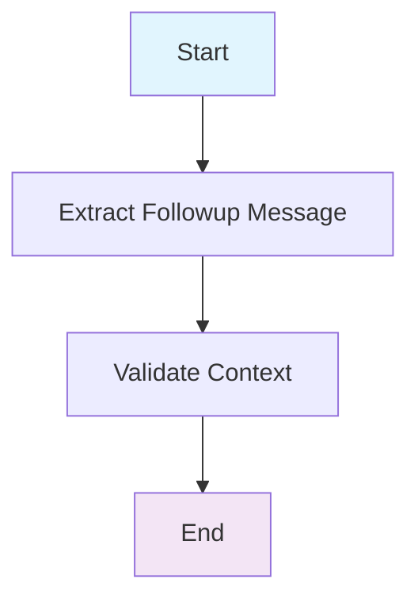

### 🎯 **Initiator Node**

**Purpose**: Generates natural, user-like response options for proactive conversation flow

**Dependencies**: Conversation context, user preferences, system responses

**Specific Work**:
- **Generates 4-6 natural responses** (4-10 words each)
- **Answers system questions** without asking questions to users
- **Handles personal attributes** (name, email, phone) with strict rules
- **Processes non-personal attributes** (property details, preferences) flexibly
- **Maintains user voice and style** consistency
- **Moves conversation forward** naturally and proactively
- **Responds to system prompts** with appropriate information

**Key Capabilities**:
- Response option generation
- Personal information handling
- Context-aware responses
- Natural flow maintenance

**Step-wise Functionality:**
1. Analyze last response to understand system questions/prompts
2. Review conversation context and user preferences
3. Determine state and requirements
4. Generate 4-6 natural responses (4-10 words each)
5. Handle personal attributes (name, email, phone) with strict rules
6. Process non-personal attributes (property details, preferences) flexibly
7. Maintain user voice and style consistency
8. Validate quality and ensure natural flow
9. Output list of natural response options for user selection

**Business Value:**
1. **Proactive Engagement**: Generate conversation starters to maintain interaction
2. **User Experience Enhancement**: Provide natural response options
3. **Information Gathering**: Collect customer data for business intelligence
4. **Conversation Flow**: Ensure smooth dialogue progression
5. **Customer Satisfaction**: Improve interaction quality and satisfaction

**Output**: List of natural response options for user selection

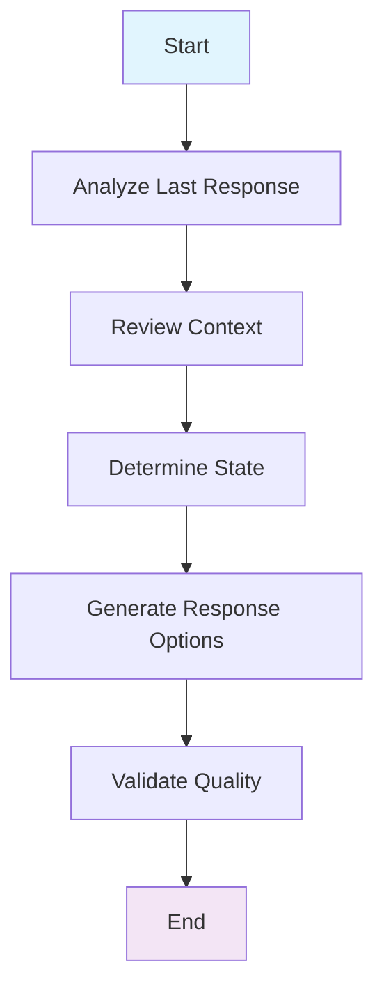

### 📝 **Summarizer Node**

**Purpose**: AI assistant that extracts structured insights from conversations

**Dependencies**: Full conversation history, existing summaries, user confirmations

**Specific Work**:
- **Analyzes and merges** past and present conversation data
- **Extracts explicit user confirmations** and updates them
- **Generates updated conversation summaries** in point-wise format
- **Analyzes sentiment** (positive, neutral, negative) and tracks trends
- **Identifies key discussion topics** and manages topic relevance
- **Calculates confidence scores** based on clarity and confirmations
- **Resolves contradictions** by prioritizing newer information

**Key Capabilities**:
- Conversation analysis
- Confirmation tracking
- Sentiment analysis
- Topic management
- Confidence scoring

**Step-wise Functionality:**
1. Review existing conversation context and summaries
2. Process new interaction data
3. Extract explicit user confirmations and update them
4. Generate updated conversation summaries in point-wise format
5. Analyze sentiment (positive, neutral, negative) and track trends
6. Identify key discussion topics and manage topic relevance
7. Calculate confidence scores based on clarity and confirmations
8. Resolve contradictions by prioritizing newer information
9. Output updated conversation summary, user confirmations, sentiment, and topics

**Business Value:**
1. **Business Intelligence**: Extract insights from customer interactions
2. **Customer Understanding**: Build comprehensive customer profiles
3. **Sentiment Analysis**: Monitor customer satisfaction and sentiment
4. **Trend Identification**: Identify patterns for business improvement
5. **Data Quality**: Maintain accurate conversation records for analysis

**Output**: Updated conversation summary, user confirmations, sentiment, and topics

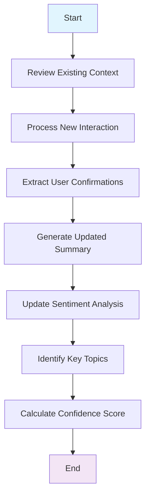

### 🗄️ **Archivist Node**

**Purpose**: Archives conversation data and maintains state

**Dependencies**: All conversation data

**Key Functions**:
- Saves conversation state
- Maintains session data
- Manages data persistence

**Step-wise Functionality:**
1. Convert state to dictionary format
2. Filter sensitive data from state
3. Save filtered state to session storage
4. Maintain session data persistence
5. Output archived state data

**Business Value:**
1. **Data Preservation**: Maintain valuable customer interaction history
2. **Privacy Protection**: Ensure sensitive data is properly handled
3. **Compliance Management**: Meet data retention and privacy requirements
4. **Business Continuity**: Enable seamless conversation resumption
5. **Analytics Foundation**: Provide data for business intelligence and improvement

**Output**: Archived state data

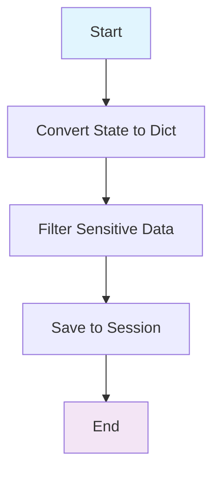

## State Management

The system uses a comprehensive state management approach:

### State Structure
```python
class State(TypedDict):
    device: str
    inputs: Dict[str, Any]
    messages: List[Any]
    data: List[Any]
    # Agent-specific states
    comprex_state: Dict[str, Any]
    router_state: Dict[str, Any]
    planner_state: Dict[str, Any]
    # ... other agent states
```

### State Persistence
- States are persisted in session storage
- Each agent maintains its own state slice
- State is filtered and cleaned before archiving

## Data Flow and Dependencies

### Agent Dependency Matrix

| Agent | Dependencies | Provides To | Data Flow |
|-------|-------------|-------------|-----------|
| **Start** | Session, Device Info | Synthesizer | Initial state, device info |
| **Synthesizer** | Conversation History, User Context, Company Data | Comprex | Enhanced input with context |
| **Comprex** | Conversation History, User Intent | Router, Onboarding, Authorization | Structured user intent |
| **Onboarding** | User Verification Status | Authorization | Onboarding completion status |
| **Authorization** | User Credentials, Session Data | Router, VOIP | Authorization status |
| **Router** | User Intent, Conversation Context | All Specialized Agents | Route selection and decision |
| **VOIP** | Calendar Availability, Company Info | Execution Report Analyzer | VOIP response and call data |
| **Report Classification** | User Input, Conversation Context | Estimate, Support, Execution Report Analyzer | Report classification |
| **Support** | Support Tickets, Service History | Execution Report Analyzer | Support responses and SOPs |
| **Appointment** | Calendar Data, Availability | Execution Report Analyzer | Appointment confirmations |
| **Estimate** | Service Catalog, Pricing Data | Execution Report Analyzer | Estimates and pricing |
| **Advisor** | Knowledge Base, Company Info | Execution Report Analyzer | Informational responses |
| **Execution Report Analyzer** | All Agent Outputs, Conversation History | Planner | Execution summary and tasks |
| **Planner** | User Intent, Execution Reports | Generator | Conversation plan and strategy |
| **Generator** | All Previous Agent Outputs, Conversation Plan | Follow-up | Final user response |
| **Follow-up** | Generator Output, Conversation Context | Initiator | Follow-up messages |
| **Initiator** | Conversation Context, User Preferences | Summarizer | Conversation starters |
| **Summarizer** | Full Conversation History | Archivist | Conversation summary |
| **Archivist** | All Conversation Data | None (End Node) | Archived state data |

### Data Flow Patterns

#### 1. Linear Flow
```
Start → Synthesizer → Comprex → Router → Specialized Agents → Execution Report Analyzer → Planner → Generator → Follow-up → Initiator → Summarizer → Archivist
```

#### 2. Conditional Branching
```
Comprex → {Onboarding | Authorization}
Authorization → {Router | VOIP}
Router → {Appointment | Support | Estimate | Advisor | Report Classification | Planner}
Report Classification → {Estimate | Support | Execution Report Analyzer}
```

#### 3. Convergence Points
- **Execution Report Analyzer**: Receives input from all specialized agents
- **Planner**: Receives execution reports and user intent
- **Generator**: Synthesizes all previous agent outputs
- **Archivist**: Final convergence point for all conversation data

## Prompt Templates and Usage

### Core Prompt Templates

| Template | Used By | Purpose |
|----------|---------|---------|
| `comprex` | Comprex Node | User intent analysis and enrichment |
| `router` | Router Node | Route decision making with weighted analysis |
| `planner/general` | Planner Node | General conversation planning |
| `planner/action` | Planner Node | Action-based planning |
| `sop_enforcer` | Multiple Agents | SOP enforcement logic across agents |
| `generator` | Generator Node | Human-like response generation |
| `summarizer` | Summarizer Node | Conversation analysis and summarization |
| `initiator` | Initiator Node | Natural response option generation |
| `execution_report_analyzer` | Execution Report Analyzer Node | Execution report processing |

### SOP Checklist Templates

| Template | Used By | Purpose |
|----------|---------|---------|
| `sop_checklists/onboarding` | Onboarding Agent | Onboarding requirements and verification |
| `sop_checklists/support` | Support Agent | Support workflow steps and ticket creation |
| `sop_checklists/estimate` | Estimate Agent | Estimation requirements and service details |

### Agent-Specific Templates

| Template | Used By | Purpose |
|----------|---------|---------|
| `advisor` | Advisor Node | Information provision and recommendations |
| `appointment` | Appointment Node | Appointment booking and scheduling |
| `estimate` | Estimate Node | Price estimation and service management |
| `retriever` | Retrieval Node | Data retrieval and service catalog access |
| `voip` | VOIP Node | Voice call handling and scheduling |

## Tool Integration

### User Tools
- **Email Verification**: `UserTool` with email verification capabilities
- **Phone Verification**: `UserTool` with phone verification capabilities

### Support Tools
- **Support Operations**: `SupportTool` for support ticket management
- **Service Warranty**: Support warranty claim processing

### Estimation Tools
- **Estimation Operations**: `EstimationTool` for price estimation
- **Service Management**: Service catalog and pricing data

## Response Format Schemas

### Structured Outputs
Each agent uses specific response format schemas:

- **SOPExecutionResult**: Used by SOP enforcement across agents
- **RouterResponse**: Route selection decisions with confidence scoring
- **GeneralPlanResponse**: Conversation planning with strategic guidance
- **ActionPlanResponse**: Action-based planning for workflows
- **GeneratorResponse**: Final response generation with followup
- **InitiatorResponse**: Conversation starters and response options
- **CSResponse**: Conversation summarization with sentiment analysis

### State Management
- **Individual Agent States**: Each agent maintains its own state slice
- **State Persistence**: States are saved to session storage
- **State Filtering**: Sensitive data is filtered before archiving