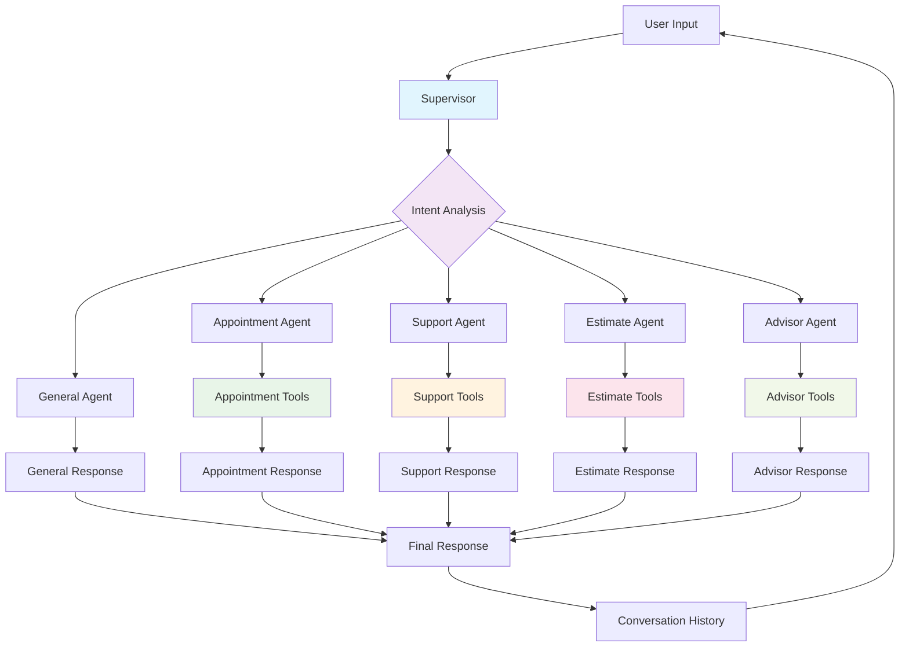
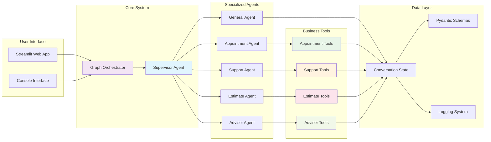
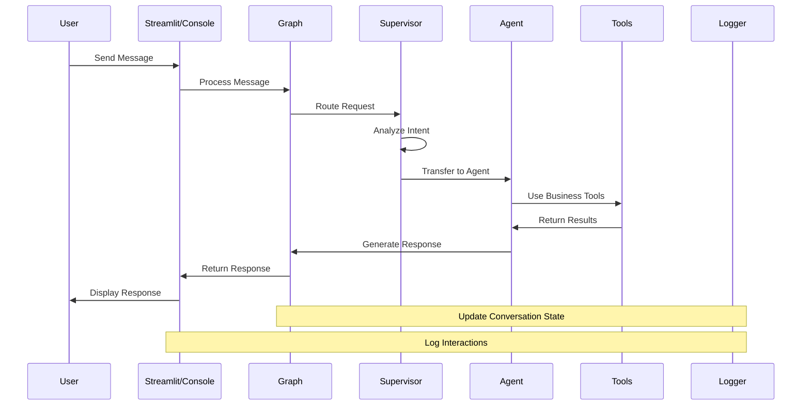

# 🤖 LangGraph Multi-Agent Supervisor System

A sophisticated multi-agent system built with LangGraph that demonstrates intelligent routing and specialized agent responses for business workflows. The system uses a supervisor pattern to intelligently route user requests to specialized agents, each equipped with functional tools for real business operations.

## 🚀 Features

### **Core Capabilities**
- **🤖 Intelligent Routing**: LLM-powered supervisor that analyzes user intent and routes to appropriate agents
- **🛠️ Functional Tools**: Real business tools for appointments, support, estimates, and information
- **💬 Conversation Context**: Maintains full conversation history across multi-turn interactions
- **🎯 Specialized Agents**: Five distinct agents handling different business domains
- **📊 Structured Output**: Pydantic schemas ensure type-safe data handling
- **🌐 Web Interface**: User-friendly Streamlit application with predefined questions
- **💻 Console Interface**: Command-line interface for direct interaction
- **🔄 ReAct Pattern**: Agents use reasoning and action for intelligent tool usage

### **Agent Specializations**
- **🤖 General Agent**: Handles casual conversation, greetings, and general inquiries
- **📅 Appointment Agent**: Manages booking, scheduling, and calendar operations with real tools
- **🎫 Support Agent**: Processes customer support and warranty claims with ticket creation
- **💰 Estimate Agent**: Provides price quotes and cost estimates with calculation tools
- **📋 Advisor Agent**: Offers business information and recommendations with service tools

### **Business Tools**
- **Appointment Tools**: Create appointments, check availability, reschedule
- **Support Tools**: Create tickets, check warranty status, escalate issues
- **Estimate Tools**: Calculate estimates, verify addresses, get service catalog
- **Advisor Tools**: Get service info, business hours, contact information

## 🏗️ System Architecture

### **High-Level Architecture**


### **Component Architecture**


### **Data Flow**


## 📁 Project Structure

```
langgraph-tutorials/
├── agents/                     # Agent implementations
│   ├── supervisor.py          # Main routing logic with handoff tools
│   ├── general_agent.py       # Casual conversation handler
│   ├── appointment_agent.py   # Appointment booking with tools
│   ├── support_agent.py       # Customer support with tools
│   ├── estimate_agent.py      # Price estimates with tools
│   └── advisor_agent.py       # Business info with tools
├── tools/                     # Functional business tools
│   ├── appointment_tools.py   # create_appointment, check_availability, reschedule
│   ├── support_tools.py       # create_support_ticket, check_warranty_status, escalate
│   ├── estimate_tools.py      # calculate_estimate, verify_address, get_service_catalog
│   └── advisor_tools.py       # get_service_info, get_business_hours, get_contact_info
├── schemas/                   # Pydantic data models
│   ├── intent_analysis.py     # Intent and agent type schemas
│   └── agent_responses.py     # Response schemas for all agents
├── utils/                     # Utility modules
│   ├── llm_helpers.py         # LLM client creation and configuration
│   └── agent_handoff.py       # Handoff tool implementations
├── core/                      # Core system components
│   └── logger.py              # Centralized logging configuration
├── logs/                      # Application logs
│   ├── application.log        # Main application logs
│   └── errors.log             # Error logs only
├── graph.py                   # Centralized graph composition
├── streamlit_app.py           # Web interface
├── main.py                    # Console interface
├── start.sh                   # Startup script
├── requirements.txt           # Python dependencies
├── pyproject.toml            # Project configuration
├── env_template.txt          # Environment variables template
└── README.md                 # This file
```

## 🛠️ Installation & Setup

### **Prerequisites**
- Python 3.8 or higher
- OpenAI API key
- Git

### **Step 1: Clone the Repository**
```bash
git clone <repository-url>
cd langgraph-tutorials
```

### **Step 2: Install Dependencies**

**Option A: Using uv (Recommended)**
```bash
# Install uv if not already installed
pip install uv

# Install dependencies
uv add langgraph langchain-openai langchain-core pydantic python-dotenv openai streamlit
```

**Option B: Using pip**
```bash
pip install -r requirements.txt
```

### **Step 3: Environment Configuration**
```bash
# Copy environment template
cp env_template.txt .env

# Edit .env file and add your OpenAI API key
nano .env
```

**Required Environment Variables:**
```env
OPENAI_API_KEY=your_openai_api_key_here
```

### **Step 4: Verify Installation**
```bash
# Test the installation
python -c "import langgraph, streamlit, openai; print('✅ All dependencies installed successfully!')"
```

## 🚀 Quick Start

### **Option 1: Using Startup Script (Recommended)**
```bash
# Make script executable
chmod +x start.sh

# Start Streamlit web interface (default)
./start.sh

# Start console interface
./start.sh console

# Show help
./start.sh help
```

### **Option 2: Direct Commands**

**Streamlit Web Interface:**
```bash
streamlit run streamlit_app.py
```
- **URL**: http://localhost:8501
- **Features**: Predefined questions, real-time chat, conversation history

**Console Interface:**
```bash
python main.py
```
- **Features**: Interactive command-line chat, type 'help' for examples

## 🎯 Usage Examples

### **Appointment Booking**
```
User: "I need to book an appointment for lawn care next Tuesday afternoon"
Agent: "I'll help you book that appointment. Let me check availability for next Tuesday..."
[Uses create_appointment tool]
Agent: "Perfect! I've created your lawn care appointment for next Tuesday afternoon. 
       Your appointment ID is APT-20241201123456. Our team will contact you to confirm the exact time."
```

### **Support Request**
```
User: "My warranty claim was denied and I'm really frustrated about it"
Agent: "I understand your frustration. Let me create a support ticket for your warranty claim issue..."
[Uses create_support_ticket tool]
Agent: "I've created a support ticket for your warranty claim issue with high priority. 
       Your ticket ID is SUP-20241201123456. Our warranty team will contact you within 24 hours."
```

### **Price Estimate**
```
User: "Can you give me a quote for cleaning services at 123 Main Street?"
Agent: "I'll calculate an estimate for house cleaning at that address..."
[Uses calculate_estimate and verify_address tools]
Agent: "I've verified that 123 Main Street is in our service area. 
       The estimate for house cleaning is $200. Estimate ID: EST-20241201123456"
```

### **Business Information**
```
User: "What services do you offer and what are your business hours?"
Agent: "Let me get that information for you..."
[Uses get_service_catalog and get_business_hours tools]
Agent: "We offer: Lawn Care, House Cleaning, Pest Control, Landscaping. 
       Business hours: Monday-Friday 8:00 AM - 6:00 PM, Saturday 9:00 AM - 4:00 PM, Sunday Closed."
```

## 🔧 Technical Implementation

### **LangGraph Pattern**
The system follows the official LangGraph supervisor pattern:
- **Supervisor Node**: LLM-powered routing with intent analysis
- **Agent Nodes**: Specialized agents with tool integration
- **Handoff Tools**: Command/Send pattern for agent transfers
- **MessagesState**: Proper conversation state management

### **ReAct Agent Implementation**
Each specialized agent uses LangChain's ReAct pattern:
```python
# Agent creation with tools
agent = create_react_agent(llm, tools, prompt)
agent_executor = AgentExecutor(agent=agent, tools=tools, verbose=True)

# Tool execution
response = agent_executor.invoke({
    "message": task_description,
    "conversation_context": conversation_context
})
```

### **Conversation Context Management**
- **Full History**: Maintains complete conversation across turns
- **Context Window**: Last 5 messages for context
- **State Persistence**: Session state in Streamlit, memory in console
- **Tool Integration**: Context-aware tool usage

### **Tool Architecture**
Each tool follows the LangChain tool pattern:
```python
@tool
def create_appointment(date: str, time: str, service: str) -> str:
    """Create a new appointment with the specified details."""
    # Implementation with error handling
    return f"Appointment created for {service} on {date} at {time}. ID: {appointment_id}"
```

### **Logging System**
- **Centralized Configuration**: Single logger configuration
- **Filtered Logging**: Only application-specific logs
- **Multiple Levels**: INFO for general logs, ERROR for errors
- **File Rotation**: Automatic log rotation and retention

## 🎨 Interface Features

### **Streamlit Web Interface**
- **Predefined Questions**: Categorized examples for easy testing
- **Real-time Chat**: Live conversation with typing indicators
- **Conversation History**: Persistent chat history
- **Metadata Display**: Expandable details for responses
- **System Information**: Sidebar with agent types and graph info
- **Clear Chat**: Button to reset conversation

### **Console Interface**
- **Interactive Chat**: Command-line conversation
- **Help System**: Built-in help and examples
- **Compact Output**: Efficient response format
- **Error Handling**: Graceful error recovery
- **Exit Commands**: Multiple ways to end session

## 🔍 System Components

### **Supervisor Agent**
- **Intent Analysis**: Analyzes user requests using LLM
- **Agent Selection**: Routes to appropriate specialized agent
- **Handoff Management**: Transfers requests with context
- **Error Handling**: Fallback mechanisms for failed routing

### **Specialized Agents**
Each agent is equipped with:
- **Domain Knowledge**: Specialized prompts for their domain
- **Tool Integration**: Access to relevant business tools
- **Context Awareness**: Understanding of conversation history
- **Error Recovery**: Graceful handling of tool failures

### **Business Tools**
- **Appointment Tools**: Real appointment management
- **Support Tools**: Actual ticket creation and management
- **Estimate Tools**: Price calculation and address verification
- **Advisor Tools**: Business information retrieval

## 📊 Dependencies

### **Core Dependencies**
- `langgraph>=0.2.0`: Core framework for multi-agent workflows
- `langchain-openai>=0.1.0`: OpenAI integration for LLM operations
- `langchain-core>=0.2.0`: Core LangChain components
- `pydantic>=2.0.0`: Data validation and serialization
- `python-dotenv>=1.0.0`: Environment variable management

### **Interface Dependencies**
- `streamlit>=1.49.0`: Web interface framework
- `openai>=1.0.0`: OpenAI API client

### **Development Dependencies**
- `loguru`: Advanced logging capabilities
- `uv`: Fast Python package manager

---

## 📊 Repository Statistics

- **Total Files**: 47 files
- **Lines of Code**: 11,555+ lines
- **Agents**: 5 specialized agents
- **Tools**: 12 functional business tools
- **Interfaces**: Web (Streamlit) + Console
- **Architecture**: LangGraph Supervisor Pattern
