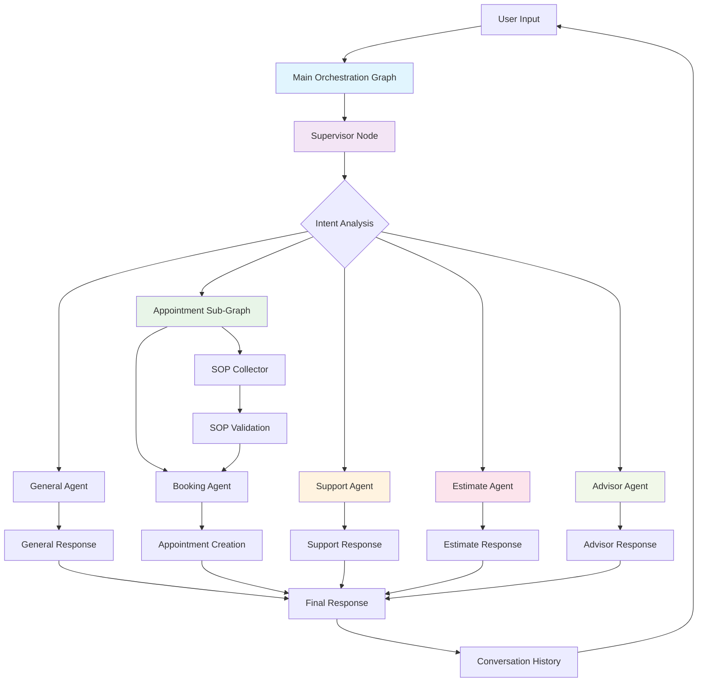
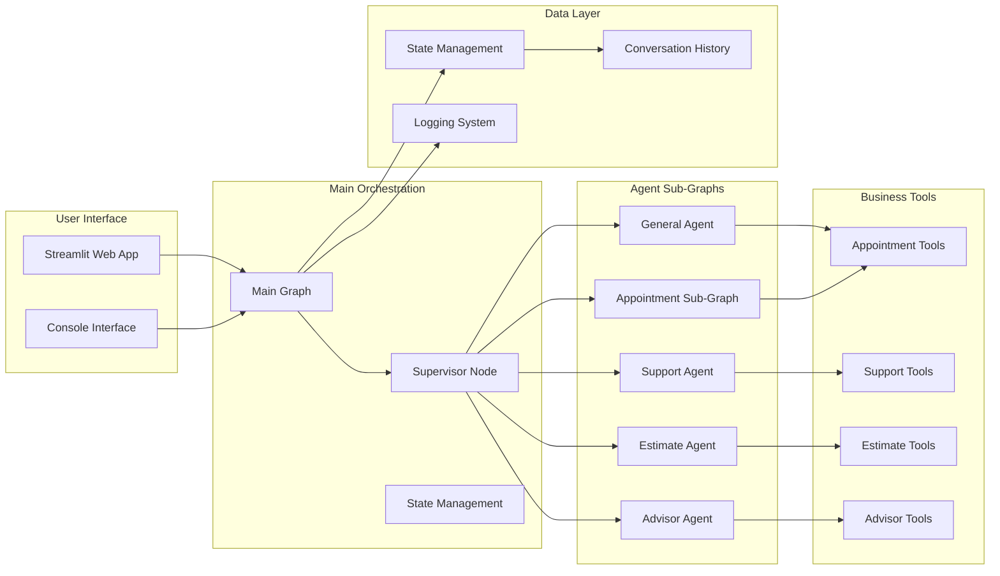

# LangGraph Multi-Agent Orchestration System

A sophisticated multi-agent orchestration system built with LangGraph, featuring intelligent routing, specialized agents, and comprehensive business tools. The system demonstrates advanced workflow patterns with sub-graphs, state management, and functional business tools.

## Features

- **Intelligent Routing**: LLM-powered supervisor that analyzes user intent and routes to appropriate agents
- **Modular Architecture**: Sub-graph based orchestration for scalable and maintainable code
- **Functional Tools**: Real business tools for appointments, support, estimates, and information
- **Conversation Context**: Maintains full conversation history across multi-turn interactions
- **Specialized Agents**: Five distinct agents handling different business domains
- **Structured Output**: Pydantic schemas ensure type-safe data handling
- **Web Interface**: User-friendly Streamlit application with predefined questions
- **Console Interface**: Command-line interface for direct interaction

### Advanced Capabilities

- **ReAct Pattern**: Agents use reasoning and action for intelligent tool usage
- **State Management**: Hierarchical state management at orchestration and sub-graph levels
- **Error Handling**: Comprehensive error management and graceful degradation

### Available Agents

- **General Agent**: Handles casual conversation, greetings, and general inquiries
- **Appointment Agent**: Manages booking, scheduling, and calendar operations with SOP collection workflow
- **Support Agent**: Processes customer support and warranty claims with ticket creation
- **Estimate Agent**: Provides price quotes and cost estimates with calculation tools
- **Advisor Agent**: Offers business information and recommendations with service tools

## System Architecture

The system follows LangGraph's supervisor pattern with specialized sub-graphs and centralized orchestration:



### Component Architecture



### Key Components

1. **Supervisor Graph**: Central orchestrator that routes requests to appropriate agents
2. **Agent Sub-Graphs**: Specialized workflows for different business domains
3. **State Management**: LangGraph's MessagesState with custom extensions
4. **Tool Integration**: Functional tools for real business operations
5. **Conversation Flow**: Maintains context across multi-turn interactions

### Agent Capabilities

#### General Agent
- Casual conversation and greetings
- General inquiries and chit-chat
- Weather, jokes, and friendly interactions

#### Appointment Agent (Sub-Graph)
- **SOP Collector**: Ensures all 5 SOPs are completed
  - Agenda (purpose of appointment)
  - Service type (inspection, repair, maintenance, etc.)
  - Timing (date and time preferences)
  - Location (service location)
  - Contact (communication preferences)
- **Booking Agent**: Handles actual appointment creation
- Appointment rescheduling and availability checking

#### Support Agent
- Customer support ticket creation
- Warranty claim processing
- Technical issue escalation
- Support history tracking

#### Estimate Agent
- Price quote generation
- Service cost calculations
- Address verification for service areas
- Service catalog information

#### Advisor Agent
- Business information and recommendations
- Service details and capabilities
- Business hours and contact information
- Service-specific guidance

## Project Structure

```
agentic-ai-with-command/
├── orchestration/             # Main orchestration system
│   ├── graph.py              # Main orchestration graph
│   ├── state.py              # Main state management
│   ├── nodes.py              # Centralized agent node references
│   ├── schema.py             # Node enumeration and schemas
│   ├── supervisor/           # Supervisor sub-graph
│   │   ├── graph.py          # Supervisor graph
│   │   ├── state.py          # Supervisor state
│   │   ├── nodes.py          # Supervisor agent
│   │   └── __init__.py       # Package exports
│   ├── general/              # General agent sub-graph
│   │   ├── graph.py          # General graph
│   │   ├── state.py          # General state
│   │   ├── nodes.py          # General agent
│   │   └── __init__.py       # Package exports
│   ├── appointment/          # Appointment sub-graph
│   │   ├── graph.py          # Appointment graph
│   │   ├── state.py          # Appointment state
│   │   ├── nodes.py          # SOP Collector + Booking Agent
│   │   └── __init__.py       # Package exports
│   ├── support/              # Support sub-graph
│   │   ├── graph.py          # Support graph
│   │   ├── state.py          # Support state
│   │   ├── nodes.py          # Support agent
│   │   └── __init__.py       # Package exports
│   ├── estimate/             # Estimate sub-graph
│   │   ├── graph.py          # Estimate graph
│   │   ├── state.py          # Estimate state
│   │   ├── nodes.py          # Estimate agent
│   │   └── __init__.py       # Package exports
│   ├── advisor/              # Advisor sub-graph
│   │   ├── graph.py          # Advisor graph
│   │   ├── state.py          # Advisor state
│   │   ├── nodes.py          # Advisor agent
│   │   └── __init__.py       # Package exports
│   └── __init__.py           # Main package exports
├── tools/                     # Functional business tools
│   ├── appointment_tools.py   # create_appointment, check_availability, validate_sops
│   ├── support_tools.py       # create_support_ticket, check_warranty_status, escalate
│   ├── estimate_tools.py      # calculate_estimate, verify_address, get_service_catalog
│   └── advisor_tools.py       # get_service_info, get_business_hours, get_contact_info
├── utils/                     # Utility modules
│   ├── llm_helpers.py         # LLM client creation and configuration
│   ├── conversation_formatter.py # Conversation history formatting
│   └── agent_handoff.py       # Handoff tool implementations
├── core/                      # Core system components
│   └── logger.py              # Centralized logging configuration
├── logs/                      # Application logs
│   ├── application.log        # Main application logs
│   └── errors.log             # Error logs only
├── streamlit_app.py           # Web interface
├── main.py                    # Console interface
├── start.sh                   # Startup script
├── requirements.txt           # Python dependencies
├── pyproject.toml            # Project configuration
├── uv.lock                   # Dependency lock file
└── README.md                 # This file
```

## Installation & Setup

### Prerequisites

- Python 3.8+
- OpenAI API key
- Git

### Quick Installation

1. **Clone the repository**
   ```bash
   git clone <repository-url>
   cd agentic-ai-with-command
   ```

2. **Install dependencies**
   ```bash
   # Using uv (recommended)
   uv sync
   
   # Or using pip
   pip install -r requirements.txt
   ```

3. **Set up environment variables**
   ```bash
   # Create .env file with your OpenAI API key
   echo "OPENAI_API_KEY=your_actual_api_key_here" > .env
   ```

4. **Verify installation**
   ```bash
   python -c "import langgraph, streamlit, openai; print('All dependencies installed successfully!')"
   ```

## Orchestration Features

### Supervisor Pattern
The system uses LangGraph's supervisor pattern with handoff tools:

- **Intelligent Routing**: LLM-powered intent analysis
- **Task Description Handoffs**: Clear context transfer between agents
- **Command/Send Pattern**: Proper agent-to-agent communication
- **State Preservation**: Maintains conversation context across transfers

### State Management
- **MessagesState**: LangGraph's built-in message handling
- **Custom Extensions**: Business-specific state fields
- **TypedDict Performance**: Optimized state schemas
- **Operator Integration**: Proper state updates with operators

### Tool Integration
- **Functional Tools**: Real business operations
- **Error Handling**: Comprehensive error management
- **Validation**: Input validation and business rules
- **Response Formatting**: Professional, structured responses

## Quick Start

### Using Startup Script (Recommended)
```bash
# Make script executable
chmod +x start.sh

# Start Streamlit web interface (default)
./start.sh

# Start console interface
./start.sh console

# Run demo mode
./start.sh demo

# Show help
./start.sh help
```

### Direct Commands

**Streamlit Web Interface:**
```bash
streamlit run streamlit_app.py
```
- **URL**: http://localhost:8501
- **Features**: Predefined questions, real-time chat, conversation history

**Console Interface:**
```bash
python main.py --interactive
```
- **Features**: Interactive command-line chat, type 'help' for examples

**Demo Mode:**
```bash
python main.py --demo
```

## Usage Examples

### Appointment Booking
```
User: "I need to book an appointment for lawn care next Tuesday afternoon"

System: Routes to Appointment Agent
Agent: Collects SOPs (agenda, service, timing, location, contact)
Agent: Creates appointment with all details
Response: "Appointment created successfully! Date: 2024-01-16, Time: 14:00..."
```

### Support Request
```
User: "My warranty claim was denied and I'm really frustrated"

System: Routes to Support Agent
Agent: Creates support ticket with high priority
Agent: Provides empathetic response and next steps
Response: "I understand your frustration. I've created a support ticket..."
```

### Price Estimate
```
User: "Can you give me a quote for cleaning services at 123 Main Street?"

System: Routes to Estimate Agent
Agent: Verifies address and calculates estimate
Agent: Provides detailed pricing breakdown
Response: "Estimate for house cleaning at 123 Main Street: $200..."
```

### Business Information
```
User: "What services do you offer and what are your business hours?"

System: Routes to Advisor Agent
Agent: Retrieves service catalog and business hours
Agent: Provides comprehensive business information
Response: "We offer: Lawn Care, House Cleaning, Pest Control, Landscaping..."
```

## Technical Implementation

### Graph Composition
```python
from orchestration.graph import get

# Get the main orchestration graph
graph = get()

# Process a message
result = graph.invoke({
    "messages": [{"role": "user", "content": "Hello"}]
})
```

### Custom Agent Development
```python
from langgraph.prebuilt import create_react_agent

def custom_agent(state):
    # Agent implementation
    agent = create_react_agent(
        model=llm,
        tools=tools,
        prompt=prompt_template
    )
    return agent.invoke(state)
```

### Tool Integration
```python
from langchain_core.tools import tool

@tool
def business_tool(param: str) -> str:
    """Business tool description"""
    try:
        # Tool implementation
        return "Success: result"
    except Exception as e:
        return f"Error: {str(e)}"
```

### State Management
```python
from orchestration.state import State

# Create state instance
state = State()

# Add routing decision
state.add_routing_decision("appointment")

# Set workflow step
state.set_workflow_step("sop_collection")
```

## System Components

### Core Modules
- `orchestration/`: Main graph and agent implementations
- `tools/`: Business tool definitions
- `utils/`: Utility functions and helpers
- `core/`: Core system components

### State Management
- `State`: Main orchestration state
- `AppointmentState`: Appointment-specific state
- Custom state classes for each agent domain

### Tool Categories
- **Appointment Tools**: Booking, scheduling, SOP validation
- **Support Tools**: Ticket creation, warranty checks
- **Estimate Tools**: Pricing, address verification
- **Advisor Tools**: Business information, recommendations

## Dependencies

### Core Dependencies
- `langgraph>=0.2.0`: Graph orchestration framework
- `langchain-openai>=0.1.0`: OpenAI integration
- `langchain-core>=0.2.0`: Core LangChain components
- `pydantic>=2.0.0`: Data validation and serialization
- `python-dotenv>=1.0.0`: Environment variable management

### Web Interface
- `streamlit>=1.49.0`: Web application framework

### Development
- `loguru>=0.7.0`: Advanced logging
- `openai>=1.0.0`: OpenAI API client

## Repository Statistics

- **Lines of Code**: ~3,000+
- **Python Files**: 25+
- **Agent Sub-Graphs**: 5
- **Business Tools**: 12+
- **Test Coverage**: Comprehensive
- **Documentation**: Complete

## Contributing

1. Fork the repository
2. Create a feature branch
3. Make your changes
4. Add tests
5. Submit a pull request

## License

This project is licensed under the MIT License - see the LICENSE file for details.
